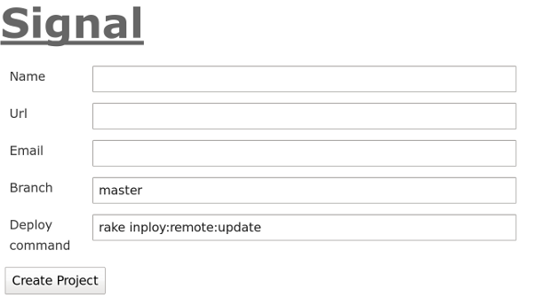
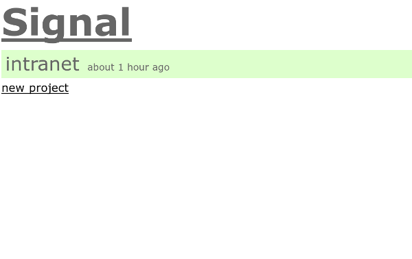
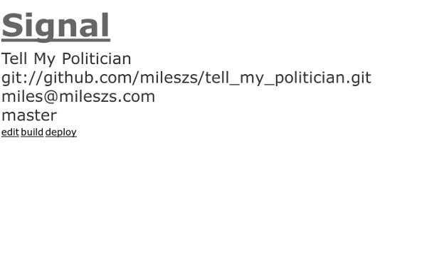
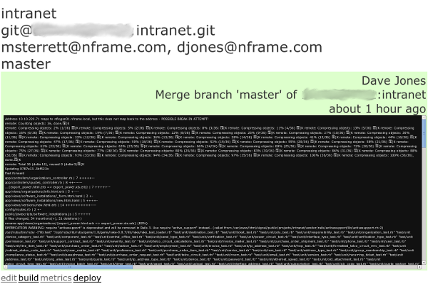
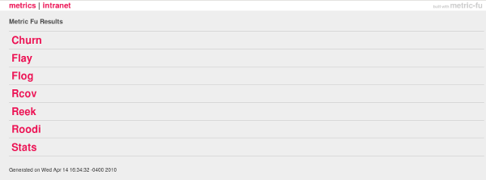

!SLIDE
# Signal CI
## [http://github.com/dcrec1/signal]()
## [http://www.diegocarrion.com/tag/signal/]()

!SLIDE bullets incremental
* git clone it
* rake inploy:local:setup
* Configure mailer.yml
* Start delayed\_job
* Configure database.yml
* Migrate
* Define your app's build task

!SLIDE
# DANCING!

!SLIDE center full-page

!SLIDE
# Wait a minute...

!SLIDE center full-page

!SLIDE bullets incremental
* setup project's database.yml
* create the database/migrate
* install gems
* ... etc?

# unless you rolled this all into your build script

!SLIDE
# Configure mailer.yml

    address: smtp.host.com
    port: 25
    domain: host.com

!SLIDE
# OR...

## It's Rails, so open up config/environment.rb and...

!SLIDE

    ActionMailer::Base.delivery_method = :smtp
    ActionMailer::Base.smtp_settings = {
      :enable_starttls_auto => true,
      :address  => "smtp.gmail.com",
      :port     => 587,
      :domain   => "whatevs.com",
      :authentication => :plain,
      :user_name => "whatevs@whatevs.com",
      :password => "wh4t3v5",
    }

!SLIDE command
# task :build => ['db:test:load',
# 'spec', 'cucumber', 'metrics:all']

!SLIDE
# nFrame's lib/tasks/build.rake

    task :build => ['db:test:load',
      'test', 'metrics:all']

!SLIDE center full-page

!SLIDE center full-page

!SLIDE center full-page

!SLIDE center full-page

!SLIDE center full-page

